# 👋 Hi, I'm bugstan

---

### 📊 GitHub Statistics (Including Private Repos)

  <!-- 移除高度限制或增加高度，使 Metrics 卡片不再显得缩水 -->
  
  

---

### 🏆 Language Distribution

  

---

### 🔥 Live Activity Graph

  <!-- 切换为 react 主题，它是更符合 GitHub 风格的深色背景，不再刺眼 -->
  

---

  

